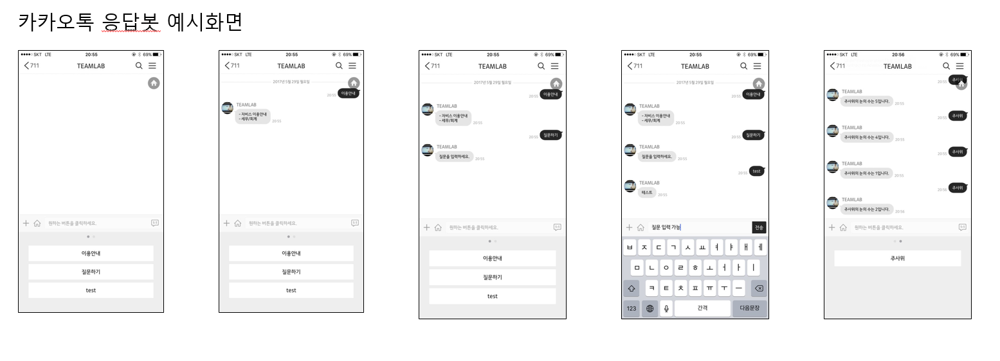
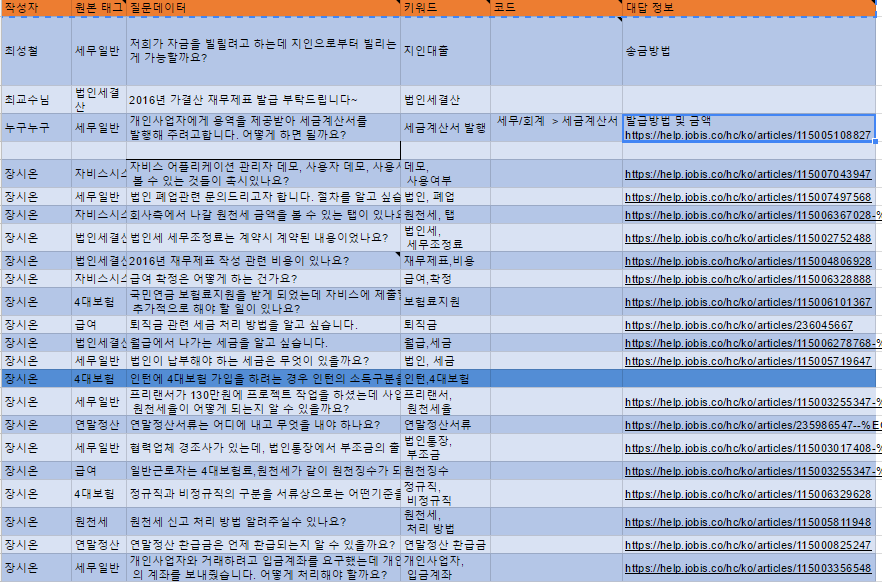

#**Project Bot_Jobis**
- 카카오톡 응답 봇
1. 관리자 도메인 연결 (fromista.gachon.ac.kr)
    자동 응답 봇 관리를 간편하게 할 수 있도록 관리 페이지를 만듬
    카카오톡과 통신을 주고 받을 앱 도메인 연결

2. Sample 버튼 추가
    이용안내 : 자동응답 봇 이용 안내 버튼
    질문하기 : 질문을 입력할 수 있는 버튼
    Test : 질문하기 버튼이 잘 동작할 수 있는지 테스트 하는 버튼
    주사위 : JS를 활용하여 만든 버튼으로 버튼을 누르면 랜덤으로  주사위 눈금을 생성해주는 버튼
3. 자동 응답 서비스 실행
    플러스 친구 서비스 실행(TEAMLAB)
    Sample 버튼 자동응답 서비스 실시

     
    
     
- Classification
1. 방향성: 데이터부족 해결
  해당하는 Class를 1, 나머지 Class를 0으로 지정 --> Multiclass 문제가 아닌 Binary문제로 변환
2. 모델
  SVM, GaussianNB, AdaBoost, XGB, NN
3. 지표
  Baseline은 데이터 숫자가 많은 Class 0의 개수/ 전체데이터 로 설정

- Text 데이터 정리
1.  데이터 부족 및 accuracy 향상을 위해 데이터 정리 및 추가 생성 필요.
      
    
      
